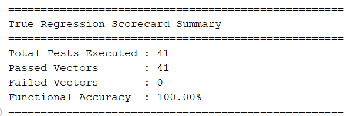

# 🚀 RISC-V RV32I 5-Stage Pipelined Processor

<p align="center">


</p>

---

# 📖 Overview

This project implements a **32-bit RISC-V RV32I 5-stage pipelined processor** written entirely in **Verilog RTL**. The processor follows the classic RISC pipeline consisting of **Instruction Fetch (IF), Instruction Decode (ID), Execute (EX), Memory Access (MEM), and Write Back (WB)** stages to improve instruction throughput while maintaining cycle-accurate execution.

The design supports the complete **RV32I Base Integer Instruction Set Architecture (ISA)** and includes dedicated hardware for resolving both **data hazards** and **control hazards**, enabling efficient execution of dependent instructions with minimal performance loss.

To ensure architectural correctness, the processor was verified using an **automated Tcl regression framework** in **Xilinx Vivado** against the **official RISC-V Architectural Test Suite**. All **41 compliance test vectors** successfully passed, demonstrating functional correctness across arithmetic, logical, branch, jump, memory, and immediate instructions.

The objective of this project was not only to design a functional processor, but also to develop a modular, synthesizable, and easily extensible RTL implementation that closely resembles industrial processor design methodologies.

---

## 📑 Table of Contents

- [✨ Key Features](#-key-features)
- [🏗 Processor Microarchitecture](#-processor-microarchitecture)
- [⚙ Pipeline Architecture](#-pipeline-architecture)
  - [Instruction Fetch (IF)](#instruction-fetch-if)
  - [Instruction Decode (ID)](#instruction-decode-id)
  - [Execute (EX)](#execute-ex)
  - [Memory Access (MEM)](#memory-access-mem)
  - [Write Back (WB)](#write-back-wb)
- [🔄 Pipeline Registers](#-pipeline-registers)
- [📂 Repository Structure](#-repository-structure)
- [🏛 RTL Module Hierarchy](#-rtl-module-hierarchy)
- [⚙ Control Unit](#-control-unit)
- [⚠ Pipeline Hazard Handling](#-pipeline-hazard-handling)
- [📊 Supported RV32I Instruction Set](#-supported-rv32i-instruction-set)
- [🛠 Verification Methodology](#-verification-methodology)
- [🔬 Verification Flow](#-verification-flow)
- [⚙ Verification Environment](#-verification-environment)
- [📋 Automated Regression Framework](#-automated-regression-framework)
- [✅ Official RV32I Architectural Compliance](#-official-rv32i-architectural-compliance)
- [📊 Regression Results](#-regression-results)
- [📸 Regression Summary](#-regression-summary)
- [📜 Complete Regression Log](#-complete-regression-log)
- [🧪 Test Coverage](#-test-coverage)
- [🎯 Verification Highlights](#-verification-highlights)
- [🚀 Quick Start](#-quick-start)
- [🧪 Running an Individual Test](#-running-an-individual-test)
- [🔄 Running Complete Regression](#-running-complete-regression)
- [📚 Learning Outcomes](#-learning-outcomes)
- [📄 License](#-license)
- [👨‍💻 Author](#author)
---

# ✨ Key Features

- ✔ Complete implementation of the **RISC-V RV32I Base Integer ISA**
- ✔ Classic **5-stage pipelined datapath**
- ✔ Modular RTL architecture for easier debugging and future expansion
- ✔ Separate Instruction and Data Memory
- ✔ Full ALU supporting all RV32I arithmetic and logical operations
- ✔ Immediate Generator supporting all RV32I instruction formats
- ✔ Register File with 32 general-purpose registers
- ✔ Hardware Data Forwarding Unit for RAW hazard resolution
- ✔ Load-Use Hazard Detection Unit with automatic pipeline stalling
- ✔ Control Hazard handling through pipeline flushing
- ✔ Support for all RV32I Load and Store variants
- ✔ Byte, Halfword, and Word memory accesses
- ✔ Branch Comparator supporting signed and unsigned comparisons
- ✔ Parameterized and modular pipeline registers
- ✔ Fully synthesizable Verilog RTL
- ✔ Automated Tcl regression environment
- ✔ Successfully passed **41/41 official RISC-V architectural compliance tests**

---

# 🏗 Processor Microarchitecture

The processor follows the standard **five-stage pipelined architecture**, allowing multiple instructions to execute simultaneously by dividing instruction execution into independent stages.

```
                +----------------------------+
                |      Instruction Memory    |
                +-------------+--------------+
                              |
                              ▼
                  ┌────────────────────┐
                  │  IF - Instruction  │
                  │      Fetch         │
                  └─────────┬──────────┘
                            │
                       IF/ID Register
                            │
                            ▼
                  ┌────────────────────┐
                  │ ID - Instruction   │
                  │ Decode & Register  │
                  │      Read          │
                  └─────────┬──────────┘
                            │
                       ID/EX Register
                            │
                            ▼
                  ┌────────────────────┐
                  │ EX - Execute / ALU │
                  │ Branch Evaluation  │
                  └─────────┬──────────┘
                            │
                       EX/MEM Register
                            │
                            ▼
                  ┌────────────────────┐
                  │ MEM - Data Memory  │
                  │ Load / Store Unit  │
                  └─────────┬──────────┘
                            │
                      MEM/WB Register
                            │
                            ▼
                  ┌────────────────────┐
                  │ WB - Write Back    │
                  │ Register File      │
                  └────────────────────┘
```

Each pipeline stage performs a dedicated task, allowing up to five different instructions to be processed concurrently, significantly improving instruction throughput compared to a single-cycle implementation.

---

# ⚙ Pipeline Architecture

The processor consists of five independent execution stages connected by dedicated pipeline registers.

---

##  Instruction Fetch (IF)

The Instruction Fetch stage is responsible for supplying instructions to the processor.

### Responsibilities

- Maintains the Program Counter (PC)
- Calculates the next instruction address
- Fetches instructions from Instruction Memory
- Computes **PC + 4**
- Selects branch and jump targets

### Major Modules

| Module | Description |
|---------|-------------|
| PC | Stores the current Program Counter |
| PCPlus4 | Computes sequential instruction address |
| PCNextMux | Selects next PC source |
| Instruction_Memory | Fetches instruction using PC |

---

##  Instruction Decode (ID)

The Decode stage interprets the fetched instruction and prepares all control information required by downstream stages.

### Responsibilities

- Decode opcode and instruction format
- Read operands from Register File
- Generate Immediate values
- Generate control signals
- Detect source and destination registers

### Major Modules

| Module | Description |
|---------|-------------|
| Control_Unit | Generates datapath control signals |
| Register_File | Reads source operands and writes back results |
| ImmSignExtend | Generates RV32I immediate values |

---

##  Execute (EX)

The Execute stage performs arithmetic, logical, comparison, and address-generation operations.

It is also responsible for evaluating branch conditions and computing jump targets.

### Responsibilities

- ALU execution
- Address calculation
- Branch comparison
- Jump target calculation
- Operand forwarding
- Branch decision generation

### Major Modules

| Module | Description |
|---------|-------------|
| ALU | Executes arithmetic and logical operations |
| ALUSrcAMux | Selects ALU operand A |
| ALUSrcBMux | Selects ALU operand B |
| Forwarding_mux | Resolves RAW hazards |
| PCAdder | Computes branch target |
| PCSrc_Evaluator | Determines next PC source |

---

##  Memory Access (MEM)

The Memory stage interfaces with Data Memory.

### Responsibilities

- Execute Load instructions
- Execute Store instructions
- Byte/Halfword/Word accesses
- Sign extension and Zero extension

### Major Modules

| Module | Description |
|---------|-------------|
| Data_Memory | Byte-addressable data memory |
| Load_extend | Load data formatting |

---

##  Write Back (WB)

The final stage writes computation results back into the Register File.

### Responsibilities

- Select ALU result
- Select Memory result
- Select PC+4 (JAL/JALR)
- Update destination register

### Major Modules

| Module | Description |
|---------|-------------|
| ResultSrcMux | Chooses write-back source |

---

# 🔄 Pipeline Registers

To isolate each execution stage, the processor uses four dedicated pipeline registers.

| Pipeline Register | Purpose |
|-------------------|---------|
| IF/ID | Stores fetched instruction and PC values |
| ID/EX | Stores decoded operands and control signals |
| EX/MEM | Stores ALU results and memory control signals |
| MEM/WB | Stores results before write-back |

These registers allow multiple instructions to execute simultaneously while preserving data consistency across clock cycles.

---

# 📂 Repository Structure

The repository is organized into dedicated directories for RTL design, verification, documentation, and RISC-V architectural test programs.

```text
RV32I-Pipelined-Core
│
├── assembly/                      # Official RV32I assembly test programs
│   ├── rv32ui-p-add.S
│   ├── rv32ui-p-sub.S
│   ├── rv32ui-p-lw.S
│   ├── rv32ui-p-beq.S
│   ├── ...
│   └── (41 Official RV32I Assembly Tests)
│
├── docs/                          # Project documentation and images
│   └── regression_summary.png
│
├── include/                       # Global Verilog header files
│   └── defines.vh
│
├── rtl/                           # Synthesizable Verilog RTL modules
│   ├── RV32I_Core.v
│   ├── ALU.v
│   ├── Control_Unit.v
│   ├── Hazard_Unit.v
│   ├── Register_File.v
│   ├── Instruction_Memory.v
│   ├── Data_Memory.v
│   ├── ...
│   └── (Additional RTL Modules)
│
├── scripts/                       # Tcl automation scripts
│   └── run_regression.tcl
│
├── tb/                            # Top-level simulation testbench
│   └── tb_riscv.v
│
├── tests_hex/                     # Compiled memory initialization files
│   ├── rv32ui-p-add.mem
│   ├── rv32ui-p-sub.mem
│   ├── rv32ui-p-lw.mem
│   ├── rv32ui-p-beq.mem
│   ├── ...
│   └── (41 Compiled RV32I Test Programs)
│
├── .gitattributes
│
└── README.md
```
---

# 🏛 RTL Module Hierarchy

The processor is organized into stage-specific modules following a hierarchical design methodology.

```text
RV32I_Core
│
├── Fetch Stage
│   ├── PC
│   ├── PCNextMux
│   ├── PCPlus4
│   └── Instruction_Memory
│
├── Decode Stage
│   ├── Control_Unit
│   ├── Register_File
│   └── ImmSignExtend
│
├── Execute Stage
│   ├── ALU
│   ├── PCAdder
│   ├── ALUSrcAMux
│   ├── ALUSrcBMux
│   ├── Forwarding_mux
│   └── PCSrc_Evaluator
│
├── Memory Stage
│   ├── Data_Memory
│   └── Load_extend
│
├── Writeback Stage
│   └── ResultSrcMux
│
├── Hazard_Unit
│
└── Pipeline Registers
    ├── Reg_if_id
    ├── Reg_id_ex
    ├── Reg_ex_mem
    └── Reg_mem_wb
```

---

# ⚙ Control Unit

The Control Unit decodes every instruction and generates all datapath control signals required for execution.

Generated control signals include:

- RegWrite
- MemWrite
- Branch
- Jump
- Jump Register (JALR)
- ALUSrcA
- ALUSrcB
- ALUControl
- Immediate Selection
- Result Source Selection

The decoder supports all standard RV32I instruction formats:

- R-Type
- I-Type
- S-Type
- B-Type
- U-Type
- J-Type

The ALU decoder further interprets **funct3** and **funct7** fields to generate the correct ALU operation.

---

# ⚠ Pipeline Hazard Handling

Pipelining introduces situations where instructions may interfere with one another. This processor includes dedicated hardware to resolve these hazards while maintaining correct program execution.

---

## Data Hazards

Data hazards occur when an instruction requires a value that has not yet been written back by a previous instruction.

Example:

```assembly
add x5, x1, x2
sub x6, x5, x3
```

Instead of waiting several clock cycles, the processor forwards the ALU result directly to the dependent instruction.

---

## Forwarding Unit

The forwarding unit dynamically selects the most recent operand value.

Supported forwarding paths include:

- EX/MEM → EX
- MEM/WB → EX

```text
        ALU Result (MEM)
               │
               ▼
        Forwarding MUX
               │
               ▼
             ALU Input
```

This eliminates unnecessary pipeline stalls for most RAW hazards.

---

## Load-Use Hazard Detection

Forwarding alone cannot resolve a dependency immediately following a Load instruction.

Example:

```assembly
lw  x5,0(x1)
add x6,x5,x7
```

Since memory data becomes available during the MEM stage, the processor:

- Detects the dependency
- Stalls IF stage
- Stalls ID stage
- Inserts one bubble into EX stage

This guarantees correct execution while minimizing performance loss.

---

## Control Hazards

Control hazards occur whenever the processor encounters:

- BEQ
- BNE
- BLT
- BGE
- BLTU
- BGEU
- JAL
- JALR

Because the next instruction depends on the branch outcome, incorrect instructions may already be inside the pipeline.

---

## Pipeline Flushing

Whenever a branch or jump changes the Program Counter, the processor automatically flushes invalid instructions.

Pipeline flushes occur for:

- Taken Branches
- JAL
- JALR

This implements a simple **Predict-Not-Taken** control hazard strategy.

---

# 📊 Supported RV32I Instruction Set

The processor implements the complete **RISC-V RV32I Base Integer Instruction Set Architecture**.

| Category | Supported Instructions |
|----------|------------------------|
| **Register Arithmetic** | ADD, SUB, SLL, SLT, SLTU, XOR, SRL, SRA, OR, AND |
| **Immediate Arithmetic** | ADDI, SLTI, SLTIU, XORI, ORI, ANDI, SLLI, SRLI, SRAI |
| **Load Instructions** | LB, LH, LW, LBU, LHU |
| **Store Instructions** | SB, SH, SW |
| **Branch Instructions** | BEQ, BNE, BLT, BGE, BLTU, BGEU |
| **Jump Instructions** | JAL, JALR |
| **Upper Immediate Instructions** | LUI, AUIPC |

---

### 📈 ISA Coverage

| Instruction Category | Status |
|----------------------|:------:|
| Register Arithmetic | ✅ |
| Immediate Arithmetic | ✅ |
| Logical Operations | ✅ |
| Shift Operations | ✅ |
| Load Instructions | ✅ |
| Store Instructions | ✅ |
| Branch Instructions | ✅ |
| Jump Instructions | ✅ |
| Upper Immediate Instructions | ✅ |

**Total RV32I Instructions Implemented:** **37 / 37 (100%)** ✅

## 📌 Highlights

- Complete RV32I Base ISA implementation
- 5-stage pipelined datapath
- Dedicated Hazard Detection Unit
- Dynamic Data Forwarding
- Pipeline Stall & Flush logic
- Modular synthesizable RTL
- Official RV32I architectural compliance verified

---

# 🛠 Verification Methodology

Verification is a critical phase in processor design to ensure that every implemented instruction behaves according to the RISC-V ISA specification. To validate the functionality of this processor, an **automated regression framework** was developed using **Tcl scripting** in **Xilinx Vivado**.

Instead of manually loading programs and checking simulation results, the regression framework automatically compiles the RTL, loads each official RV32I architectural test into instruction memory, executes the simulation, detects program completion, and reports the final **PASS/FAIL** status.

The processor was validated against the **official RISC-V RV32I Architectural Test Suite**, covering arithmetic, logical, memory, branch, jump, and immediate instructions.

---

# 🔬 Verification Flow

The complete verification process is illustrated below.

```text
              Official RV32I Assembly Tests
                         │
                         ▼
          RISC-V GNU Toolchain (Assembler)
                         │
                         ▼
          ELF Executable Generation
                         │
                         ▼
          Hex / Memory File Conversion
                         │
                         ▼
          Vivado Testbench Initialization
                         │
                         ▼
             RTL Simulation Execution
                         │
                         ▼
          Automatic PASS / FAIL Detection
                         │
                         ▼
             Regression Summary Report
```

---

# ⚙ Verification Environment

| Component | Tool |
|-----------|------|
| RTL Design | Verilog HDL |
| Simulator | Xilinx Vivado Simulator |
| Automation | Tcl Scripts |
| Test Programs | Official RISC-V ISA Tests |
| Machine Code Generation | RISC-V GNU Toolchain |
| Memory Initialization | HEX / MEM Files |

---

# 📋 Automated Regression Framework

A custom Tcl regression script automates the entire verification process.

The script performs the following steps:

- Compiles all RTL modules
- Compiles the testbench
- Loads an official RV32I test program
- Starts simulation
- Waits for program completion
- Detects PASS/FAIL automatically
- Records test results
- Repeats for every test vector
- Generates a final regression summary

This eliminates repetitive manual work and guarantees consistent verification across multiple simulations.

---

# ✅ Official RV32I Architectural Compliance

The processor was verified using **41 official RV32I architectural compliance tests**.

The test suite validates:

- Integer arithmetic
- Logical operations
- Shift operations
- Immediate instructions
- Load instructions
- Store instructions
- Branch instructions
- Jump instructions
- Upper immediate instructions
- Memory access behavior
- Pipeline correctness
- Control-flow correctness

Every test completed successfully without functional failures.

---

# 📊 Regression Results

The processor achieved a **100% pass rate** across all official RV32I architectural test vectors.

| Metric | Result |
|---------|:------:|
| Total Tests Executed | **41** |
| Passed Tests | ✅ **41** |
| Failed Tests | ❌ **0** |
| Functional Accuracy | **100.00%** |

---

# 📸 Regression Summary

The automated Tcl regression environment generates the following verification summary after executing the complete test suite.

<p align="center">
    
</p>

---

# 📜 Complete Regression Log

<details>

<summary><b>Click to View Complete 41-Test Regression Log</b></summary>

```text
====================================================
RISC-V 41-TEST REGRESSION ENVIRONMENT LAUNCHED
====================================================

Running rv32ui-p-add              ... PASS
Running rv32ui-p-addi             ... PASS
Running rv32ui-p-and              ... PASS
Running rv32ui-p-andi             ... PASS
Running rv32ui-p-auipc            ... PASS
Running rv32ui-p-beq              ... PASS
Running rv32ui-p-bge              ... PASS
Running rv32ui-p-bgeu             ... PASS
Running rv32ui-p-blt              ... PASS
Running rv32ui-p-bltu             ... PASS
Running rv32ui-p-bne              ... PASS
Running rv32ui-p-jal              ... PASS
Running rv32ui-p-jalr             ... PASS
Running rv32ui-p-lb               ... PASS
Running rv32ui-p-lbu              ... PASS
Running rv32ui-p-ld_st            ... PASS
Running rv32ui-p-lh               ... PASS
Running rv32ui-p-lhu              ... PASS
Running rv32ui-p-lui              ... PASS
Running rv32ui-p-lw               ... PASS
Running rv32ui-p-ma_data          ... PASS
Running rv32ui-p-or               ... PASS
Running rv32ui-p-ori              ... PASS
Running rv32ui-p-sb               ... PASS
Running rv32ui-p-sh               ... PASS
Running rv32ui-p-simple           ... PASS
Running rv32ui-p-sll              ... PASS
Running rv32ui-p-slli             ... PASS
Running rv32ui-p-slt              ... PASS
Running rv32ui-p-slti             ... PASS
Running rv32ui-p-sltiu            ... PASS
Running rv32ui-p-sltu             ... PASS
Running rv32ui-p-sra              ... PASS
Running rv32ui-p-srai             ... PASS
Running rv32ui-p-srl              ... PASS
Running rv32ui-p-srli             ... PASS
Running rv32ui-p-st_ld            ... PASS
Running rv32ui-p-sub              ... PASS
Running rv32ui-p-sw               ... PASS
Running rv32ui-p-xor              ... PASS
Running rv32ui-p-xori             ... PASS

====================================================
True Regression Scorecard Summary
====================================================

Total Tests Executed : 41
Passed Vectors       : 41
Failed Vectors       : 0
Functional Accuracy  : 100.00%

====================================================
```

</details>

---

# 🧪 Test Coverage

The regression suite verifies the complete RV32I Base Integer ISA.

| Category | Coverage |
|----------|:--------:|
| Register Arithmetic | ✅ |
| Immediate Arithmetic | ✅ |
| Logical Operations | ✅ |
| Shift Operations | ✅ |
| Load Instructions | ✅ |
| Store Instructions | ✅ |
| Branch Instructions | ✅ |
| Jump Instructions | ✅ |
| Upper Immediate Instructions | ✅ |
| Sign Extension | ✅ |
| Zero Extension | ✅ |
| Memory Alignment | ✅ |
| Pipeline Execution | ✅ |
| Hazard Handling | ✅ |

---

# 🎯 Verification Highlights

- ✅ Fully automated Tcl-based regression framework
- ✅ Official RISC-V Architectural Compliance Tests
- ✅ 41/41 tests successfully passed
- ✅ 100% functional accuracy
- ✅ Automatic PASS/FAIL detection
- ✅ Vivado simulation automation
- ✅ Regression summary generation
- ✅ Reproducible verification workflow
- ✅ Cycle-accurate RTL validation

---
# 🚀 Quick Start

This section explains how to clone the repository, launch the simulation environment, and execute both individual and automated regression tests.

---

## 📋 Prerequisites

Before running the project, ensure the following software is installed.

| Tool | Purpose |
|------|---------|
| Xilinx Vivado | RTL Simulation |
| Git | Repository Management |
| RISC-V GNU Toolchain *(Optional)* | Assemble custom test programs |
| Tcl | Regression Automation (Included with Vivado) |

---

# ▶ Running Simulation

Launch **Vivado** and open the **Tcl Console**.

Navigate to the scripts directory.

```tcl
cd scripts
```

Run the regression script.

```tcl
source run_regression.tcl
```

The script automatically performs the following:

- Compiles every RTL module
- Compiles the testbench
- Loads the selected memory file
- Starts simulation
- Detects PASS/FAIL
- Generates a regression report

No manual intervention is required.

---

# 🧪 Running an Individual Test

To execute a single architectural test:

1. Copy the desired `.mem` file into the instruction memory initialization path.

Example:

```text
tests_hex/
    rv32ui-p-add.mem
```

Run simulation.

```tcl
restart
run all
```

Observe the console output.

```text
Running rv32ui-p-add ... PASS
```

---

# 🔄 Running Complete Regression

Execute:

```tcl
source run_regression.tcl
```

The script automatically runs:

- ADD
- SUB
- AND
- OR
- XOR
- SLL
- SRL
- SRA
- Immediate Instructions
- Branch Instructions
- Jump Instructions
- Memory Instructions

until all **41** official tests have completed.

---

# 📚 Learning Outcomes

This project provided practical experience with:

- RISC-V ISA implementation
- Verilog RTL design
- Processor datapath design
- Pipeline architecture
- Hazard detection
- Data forwarding
- Pipeline stalling
- Pipeline flushing
- Control signal generation
- Memory interface design
- Automated regression testing
- Tcl scripting
- Vivado simulation
- Processor verification

---

# 📄 License

This project is licensed under the **MIT License**.

You are free to use, modify, and distribute this project for educational and research purposes in accordance with the license terms.

---

## Author

**Gourav Kumar Jha**
---
